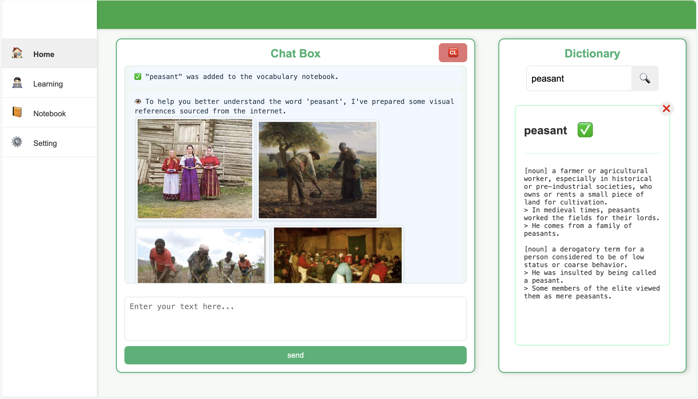
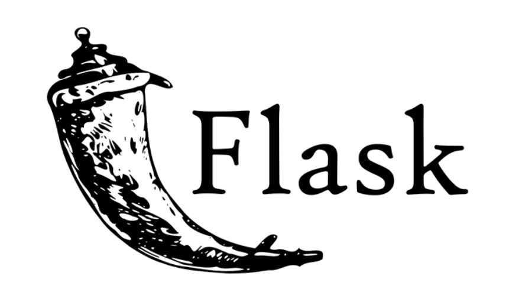

<div align="center">
  <a href="https://github.com/goer17/clara">
    
  </a>
<h3 align="center">Clara: Your AI-Powered English Learning Agent</h3>
  <p align="center">
    🤖 Clara is an LLM-powered agent integrated with a graph database and other tools, designed to assist non-native students in learning English.
  </p>
</div>


Meet **Clara** - your personal AI English coach! Through personalized AI-generated exercises, Clara provides interactive learning tasks tailored to each student's needs. Below is an overview of its core workflow.





### Built With

OpenAI SDK (LLM integration), Neo4j (graph database), ChromaDB (vector database), and Flask (backend).

---

[](https://neo4j.com/)

---

[][https://docs.trychroma.com/]

---

[](https://flask.palletsprojects.com/)


### Getting Started

For optimal deployment, we recommend using Docker to run this web application.

Before deployment, ensure you have:

1. Valid API keys for all required LLM services
2. Docker and Docker Compose installed

Create or modify the `.env` file with your API credentials :

```env
OPENAI_BASE_URL=
OPENAI_API_KEY=

DEEPSEEK_BASE_URL=
DEEPSEEK_API_KEY=
```

Then simply execute :

```shell
docker-compose -p clara up -d
```

Once the containers are running, you can access the **Clara** interface at : http://localhost:8088

